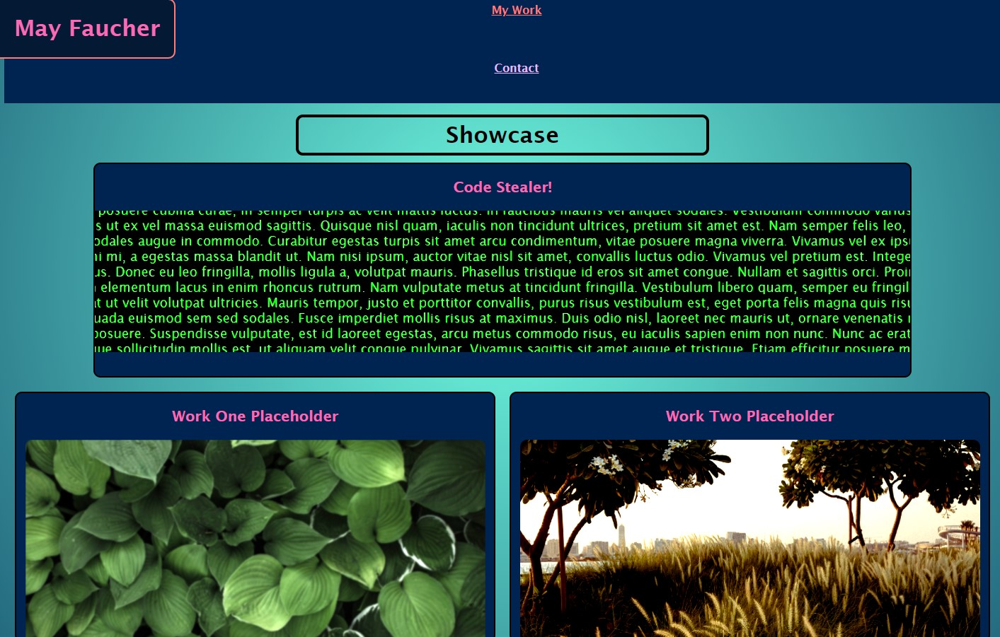

# divinemayura.github.io
# Portfolio

Portfolio page with responsive design.

## Built With

* [HTML](https://developer.mozilla.org/en-US/docs/Web/HTML)
* [CSS](https://developer.mozilla.org/en-US/docs/Web/CSS)

## Deployed Link

* [See Live Site](https://divinemayura.github.io/)

## Authors

* **May Faucher** 

- [Link to Portfolio Site](https://divinemayura.github.io/)
- [Link to Github](https://github.com/DivineMayura)
- [Link to LinkedIn](www.linkedin.com/in/mayfaucher)

-[Matt Stephens](https://github.com/mstephen19) huge help on refractoring my spaghetti code and gave some extremely good pointers and advice, introduced and taught new tips and tricks to improve my css and html skills.

## License

This project is licensed under the MIT License 

## image

